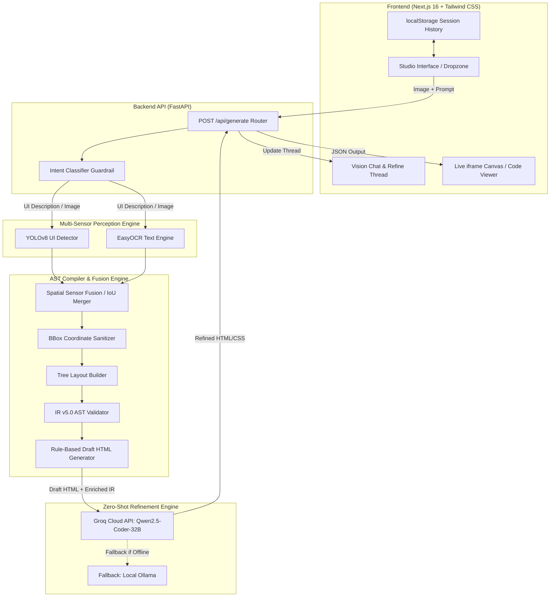
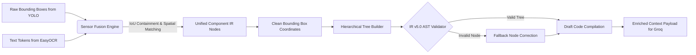
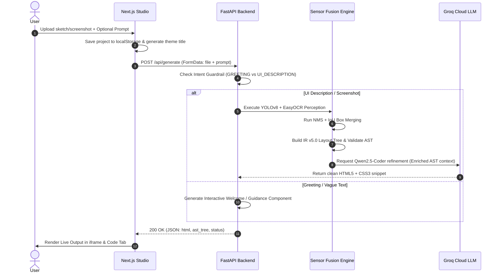

# ⚡ Snipcode — Screenshot-to-Code AI Studio

> **Vision-to-Code Compiler Engine** powered by **Multi-Sensor Perception (YOLOv8 + EasyOCR)**, **Sensor Fusion NMS Engine**, **IR v5.0 AST Compiler**, and **Zero-Shot LLM Code Refinement (Groq Qwen2.5-Coder)**.


---

## 📌 Overview

**Snipcode** transforms UI wireframes, hand-drawn sketches, and application screenshots into production-ready **HTML5 & CSS3 code**. 

Unlike standard prompt-only LLM generators, Snipcode utilizes a **Multi-Sensor Perception Pipeline** that detects spatial UI bounding boxes via YOLOv8, extracts textual tokens via EasyOCR, merges overlaps with a **Spatial Sensor Fusion Engine**, validates an **Intermediate Representation (IR v5.0) AST Tree**, and passes enriched structural context to **Groq Qwen2.5-Coder / Llama 3.3** for pixel-accurate code generation.

---

## ✨ Key Features

- **👁️ Multi-Sensor Perception**: Combines object detection (YOLOv8) with optical character recognition (EasyOCR) for robust UI element extraction.
- **🔗 Sensor Fusion Engine**: Merges overlapping bounding boxes, assigns semantic roles (`button`, `input`, `heading`, `card`), and resolves spatial containment using IoU and NMS filtering.
- **🌳 IR v5.0 AST Validation**: Constructs a validated tree schema of UI nodes before code generation to prevent missing form inputs or broken layouts.
- **🛡️ Intent Classifier Guardrails**: Automatically categorizes user prompts into `GREETING`, `VAGUE_TEXT`, or `UI_DESCRIPTION` to provide guided starter templates for non-UI queries.
- **⚡ Groq Cloud LLM Integration**: Uses `Qwen 2.5 Coder 32B` / `Llama 3.3 70B` via Groq Cloud API for ultra-fast, zero-shot HTML/CSS compilation with fallback to local Ollama.
- **🎨 Glassmorphic Next.js 16 Studio**: Compact responsive sidebar, live interactive preview canvas, copy-to-clipboard code viewer, and localStorage session history.

---

## 🏛️ System Architecture



---

## 🤖 Model Usage & AI Stack

| Layer | Technology / Model | Role & Description |
|---|---|---|
| **Vision Detection** | **YOLOv8 (`best.pt`)** | Detects UI elements (`button`, `input`, `container`, `card`, `icon`, `heading`). |
| **Text Extraction** | **EasyOCR (`CRAFT + ResNet`)** | Extracts text labels, button captions, and values with pre-processing (CLAHE + adaptive thresholding). |
| **Sensor Fusion** | **IoU / NMS Spatial Merger** | Merges text boxes with parent container bounding boxes to build a unified spatial node list. |
| **LLM Refinement** | **Qwen 2.5 Coder 32B (Groq)** | Generates clean, responsive HTML5 + CSS3 matching the AST structure. |
| **LLM Fallback** | **Llama 3.3 70B (Groq) / Ollama** | Secondary LLM provider fallback when primary cloud API key or quota is unavailable. |

---

## ⚙️ Sensor Fusion & AST Engine Architecture



---

## 🔄 Full Pipeline Sequence Overview



---

## 📂 Repository Structure

```
snipcode/
├── backend/
│   ├── app/
│   │   ├── main.py             # FastAPI entry point & Intent Guardrail
│   │   ├── ocr.py              # EasyOCR lazy-loader & image pre-processing
│   │   ├── models/
│   │   │   └── best.pt         # Trained YOLOv8 UI detection weights (6.2 MB)
│   │   └── services/
│   │       ├── detector.py     # YOLOv8 target detection module
│   │       ├── fusion.py       # Sensor fusion & spatial IoU merging
│   │       ├── cleaner.py      # Bounding box coordinate sanitizer
│   │       ├── layout.py       # Hierarchical tree builder
│   │       ├── validator.py    # IR v5.0 AST validator
│   │       ├── generator.py    # Rule-based draft code generator
│   │       └── llm.py          # Groq Cloud API & Ollama refinement bridge
│   ├── .env.example            # Environment variables template
│   └── requirements.txt        # Python backend dependencies
│
├── frontend/
│   ├── src/
│   │   ├── app/
│   │   │   ├── page.tsx        # Studio home page with image dropzone
│   │   │   ├── layout.tsx      # App root layout & Poppins font setup
│   │   │   ├── globals.css     # Glassmorphic utilities & background styles
│   │   │   └── project/[id]/   # Workspace page (Vision Thread + Code/Preview)
│   │   └── hooks/
│   │       └── useProjectHistory.ts # localStorage project history & auto-theming
│   ├── .env.example            # Frontend environment variables template
│   ├── .env.local              # Local environment variables
│   └── package.json            # Next.js dependencies
│
├── docs/
│   └── images/                 # Architecture diagrams and graphics
├── .gitignore                  # Git exclusion rules
└── README.md                   # Project documentation
```

---

## 🔑 Environment Setup

### 1. Backend (`backend/.env`)
Create `backend/.env` (or copy from `backend/.env.example`):
```env
# Groq Cloud API Key (Get a free key at https://console.groq.com)
GROQ_API_KEY=your_groq_api_key_here
GROQ_MODEL=qwen-2.5-coder-32b

# CORS Configuration
ALLOWED_ORIGINS=http://localhost:3000,http://127.0.0.1:3000,*
```

### 2. Frontend (`frontend/.env.local`)
Create `frontend/.env.local` (or copy from `frontend/.env.example`):
```env
NEXT_PUBLIC_API_URL=http://127.0.0.1:8000
```

---

## 🚀 Local Running Instructions

### 1. Start the FastAPI Backend
```bash
cd backend
python -m venv venv
# On Windows:
venv\Scripts\activate
# On macOS/Linux:
# source venv/bin/activate

pip install -r requirements.txt
python -m uvicorn app.main:app --reload --port 8000
```
Backend API will be live at: **`http://127.0.0.1:8000`**

### 2. Start the Next.js Frontend
```bash
cd frontend
npm install
npm run dev
```
Frontend Web App will be live at: **`http://localhost:3000`**

---

## ☁️ Deployment Guide

### Deploying Frontend to Vercel
1. Import repository to **[Vercel](https://vercel.com)**.
2. Set **Root Directory** to `frontend`.
3. Add Environment Variable:
   - `NEXT_PUBLIC_API_URL` = `https://your-backend.railway.app`
4. Click **Deploy**.

### Deploying Backend to Railway / Render
1. Import repository to **[Railway](https://railway.app)** or **Render**.
2. Set **Root Directory** to `backend`.
3. Add Environment Variable:
   - `GROQ_API_KEY` = `your_groq_api_key`
   - `ALLOWED_ORIGINS` = `https://your-frontend.vercel.app`
4. Start Command: `uvicorn app.main:app --host 0.0.0.0 --port $PORT`

---

## 📄 License

Distributed under the MIT License. See `LICENSE` for details.
